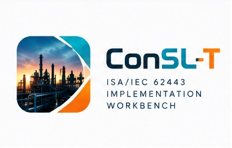

# ConSL-T

**An ISA/IEC 62443 implementation workbench for industrial asset owners. Coming soon.**

ConSL-T takes any industrial or OT site, from water treatment and power to chemicals,
oil and gas, pharma, manufacturing and food, from its first asset inventory to audit-ready
deliverables. It works out the answers
instead of handing you forms to fill in: security targets, applicable requirements, gaps,
risks and a plan to close them.

## What it does

- **Models the plant:** asset inventory with fields that fit each kind of equipment, site
  walkdown capture, spreadsheet import, and a proposed zone and conduit design you refine.
- **Sets targets:** each zone's security-level target (SL-T) is derived from consequence and
  threat using a transparent, versioned method.
- **Assesses:** works out which system requirements (62443-3-3) apply to each zone and the
  gap between the level achieved (SL-A) and the target.
- **Analyses risk:** a guided CyberPHA-style workshop with threat scenarios seeded from MITRE
  ATT&CK for ICS, rated against your organization's own risk criteria, with countermeasure
  credit and a risk register that checks every decision against tolerance.
- **Plans:** ranks gaps by severity and turns them into a costed mitigation plan and a dated
  roadmap, with the posture improvement each action buys.
- **Runs the programme:** the organizational requirements (62443-2-1), evidence,
  compensating controls, management of change, verification test plans and audit
  readiness, mapped to ISO 27001, NIST CSF 2.0 and NIST SP 800-82.

## The automation does the heavy lifting

ConSL-T reads the plant and applies the standard's rules for you. Every automatic answer is
written with its reason, marked as automatic, and a person's edit always takes precedence.

- **Targets worked out for every zone,** raised automatically for zones exposed to the
  internet or a vendor's remote access, and for zones sitting behind such a zone with no
  firewall between them.
- **Requirements judged from your controls:** record a firewall, a backup, monitoring or a
  login policy once, and every requirement it answers is judged across every zone it covers.
- **A plan proposed for you:** actions that close your gaps, the zones and machines each one
  touches, and a clear line between changing the plant and writing down what is already true.
- **The programme read from your records:** policies, training, change records, reviews and
  supplier assessments judge the organizational requirements and their maturity.
- **Threats and regulations identified:** the ICS attack techniques that apply to each zone,
  and the regulations each site's sector and location bring (NIS2, Seveso III, OSHA PSM,
  EPA RMP and more).
- **What to record next:** where the engine cannot decide, it says which fact on which
  machine would let it, grouped so one site visit answers many questions.
- **Nothing goes quietly out of date:** when an input changes, every result that depended
  on it is flagged for review.

## Ready-made worked examples

Five complete reference plants (a water works, a substation, an oil and gas unit, a pharma
site and a manufacturing line) ship with ConSL-T, so you can explore a finished assessment
before starting your own.

## Deliverables, generated

- Cybersecurity Requirements Specification
- Risk and gap reports, including the detailed risk assessment
- Executive dashboard and summary
- Assessor pack (PDF and HTML)
- A tamper-evident sealed bundle an auditor can verify independently

## Runs locally

ConSL-T runs on your own machine. Your plant's details stay with you.

## Status

In final testing ahead of its first release. Watch this repository to hear when it is
available.
